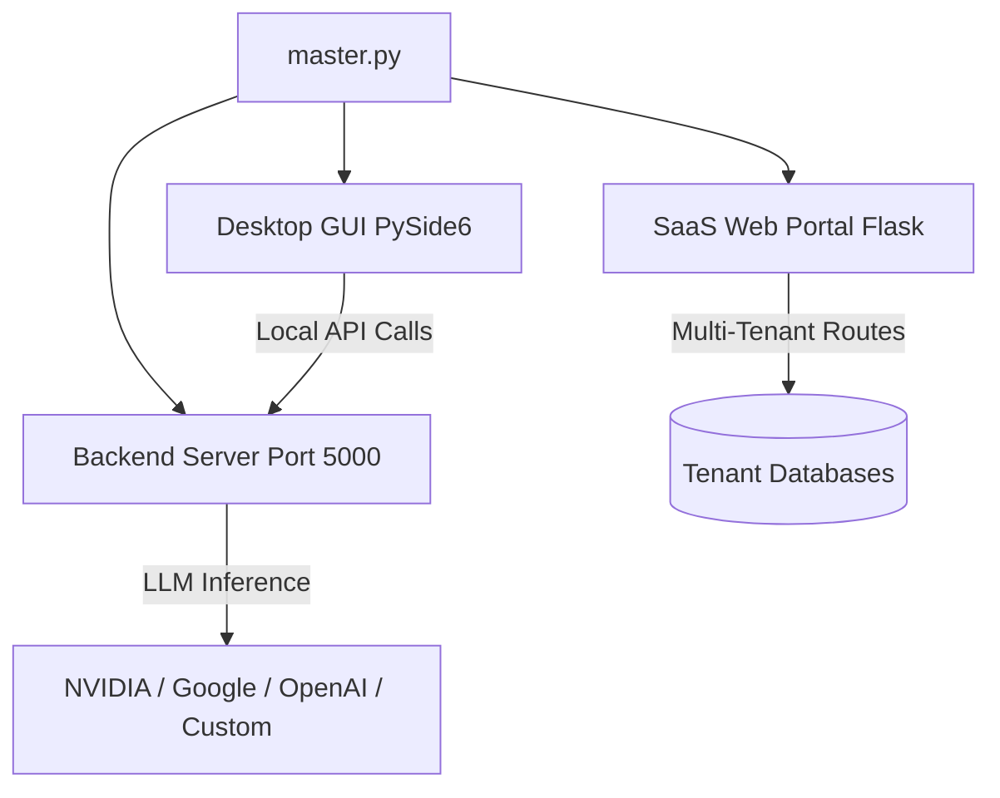

# Synora Studio: Deep Architecture Analysis Report

This document provides a comprehensive, deep-dive analysis into the architecture, technical design, and core workflows of **Synora Studio v1.0.0**.

> [!NOTE]
> Synora Studio is a highly modular, multi-tier ecosystem composed of a local Desktop GUI, a decoupled headless backend server, and a fully featured multi-tenant SaaS web portal. 

---

## 🏛️ 1. Macro Architecture & Orchestration

The application operates as a distributed system capable of running locally via PySide6 or over the web via Flask. The root orchestrator is **[master.py](file:///c:/Users/user/OneDrive/Desktop/python/Synora_Studio/master.py)**, which launches three primary modules concurrently:
1. **Backend API Server** (`server/run_server.py`)
2. **SaaS Web Portal** (`web/run_web.py`)
3. **Desktop GUI** (`desktop/main.py`)

### Headless & CLI Execution
The **[desktop/main.py](file:///c:/Users/user/OneDrive/Desktop/python/Synora_Studio/desktop/main.py)** file features an intelligent `detect_environment()` function. If it detects a Linux environment without an X11/Wayland display, an SSH session, or a `--headless`/`--cli` flag, it gracefully bypasses PySide6 initialization. It drops the user directly into a terminal-based interactive chat (`HeadlessEngine`), ensuring the application can run on remote Linux boxes or Docker containers.

---

## 🧠 2. LLM Orchestration & Client Abstraction

The core intelligence router is located in **[server/logic/llm_client.py](file:///c:/Users/user/OneDrive/Desktop/python/Synora_Studio/server/logic/llm_client.py)**. 

### Key Characteristics:
- **Universal Provider Support:** The `LLMClient` class seamlessly abstracts multiple SDKs including `openai` (for NVIDIA NIMs, OpenAI, vLLM, LMStudio, Ollama), `google-genai` (for Gemini models), and Anthropic.
- **Dynamic Capabilities Detection:** Rather than hardcoding capabilities, the system uses "Smart Validation Guards" (e.g., `is_model_vision_capable()`, `is_model_coding_capable()`). It scans model JSON schemas for explicit capabilities, and falls back to string heuristics (e.g., matching `-vl`, `vision`, `pixtral`).
- **Unified Generation Interface:** `_run_completion_internal()` dynamically routes prompt generation to the appropriate SDK's native schema format, standardizing the return payload to simple strings or forced JSON.
- **Background Enrichment:** Models are enriched dynamically with auto-generated descriptions using lightweight LLM batching (`generate_descriptions_batch`).

> [!TIP]
> The abstraction relies on OS-level encrypted keyrings (`keyring` library + custom AES decryption) for credential storage, protecting against plaintext token leaks.

---

## 🌐 3. SaaS Multi-Tenant Cloud Gateway

The **[web/app.py](file:///c:/Users/user/OneDrive/Desktop/python/Synora_Studio/web/app.py)** acts as a robust enterprise gateway for the Synora SaaS portal.

### Security & Routing:
- **Pre-flight Validation (`/api/validate_passport`):** Users must provide a valid API key (Passport) which is dynamically validated against NVIDIA/OpenAI endpoints *before* a profile is provisioned in the database.
- **Tenant Isolation:** A globally injected `enforce_tenant_authorization()` middleware intercepts all protected routes. It verifies Bearer JWT tokens, fetches the underlying user record, and embeds it into `request.tenant` for downstream logic.
- **Rate Limiting:** Uses a Redis-backed (or in-memory token bucket) approach, restricting global IPs to 120 RPM and individual tenants to custom limits (e.g., 60 RPM).
- **Hermes Agent Framework:** Supports spinning up background autonomous agents (`AgentManager`) per tenant.

### Sub-systems:
- **Autonomous SMTP Relay:** The app ships with an inbuilt, zero-dependency SMTP email relay to alert users when their workspaces are provisioned.
- **Role-Based Access Control (RBAC):** Admin endpoints (e.g., `/api/admin/*`) are strictly guarded by `ServiceRegistry.get("security").check_permission(user, "admin")`.

---

## 🗃️ 4. Pluggable Storage & Persistence

The application employs a highly abstracted Database layer, defined by **[server/logic/storage_drivers/base_driver.py](file:///c:/Users/user/OneDrive/Desktop/python/Synora_Studio/server/logic/storage_drivers/base_driver.py)**.

### Driver Architecture:
The `BaseStorageDriver` enforces an interface with 22 abstract methods (including OCC - Optimistic Concurrency Control checks via `expected_version` integers).
Implementations include:
- `sqlite_driver.py`: Local Desktop File-based WAL driver.
- `libsql_driver.py`: Cloud Edge Replication driver (Turso).
- `postgres_driver.py`: Enterprise Cluster MVCC driver.

> [!IMPORTANT]
> A dedicated **Companion Operation** (located in `operator_tools/companion/`) is provided to migrate data transactionally between these storage engines without downtime.

---

## 🚀 5. Local Server & Thread Isolation

The **[server/logic/api_manager.py](file:///c:/Users/user/OneDrive/Desktop/python/Synora_Studio/server/logic/api_manager.py)** enables Synora to act as a local OpenAI-compatible endpoint.
- It exposes a Flask server running on port `5000` (by default).
- IDE extensions (like VS Code or JetBrains plugins found in `extensions/`) can point directly to `http://localhost:5000/v1` to leverage local LLM inference without sending code out to the public internet.
- Request handling bridges between the Flask thread pool and the PySide6 UI thread (or Headless Worker pool) using Python `queue.Queue()`, ensuring safe concurrency.

## 📝 Conclusion
Synora Studio is an exceptionally advanced, decoupled ecosystem. Its primary strength lies in its **environment adaptability**—capable of running as a rich local desktop application, a headless CLI agent, or a fully functional cloud SaaS gateway, while utilizing a unified LLM core and pluggable storage backends.
